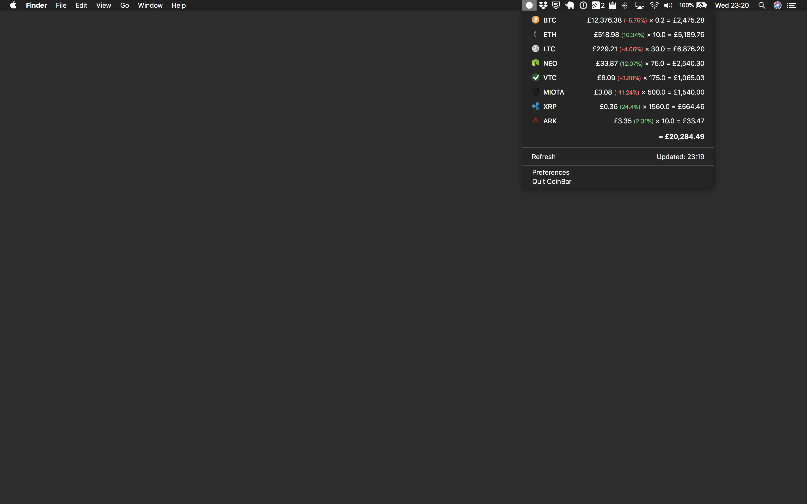
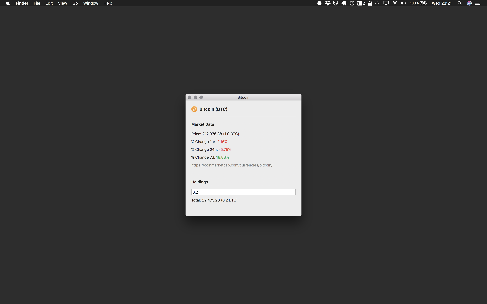
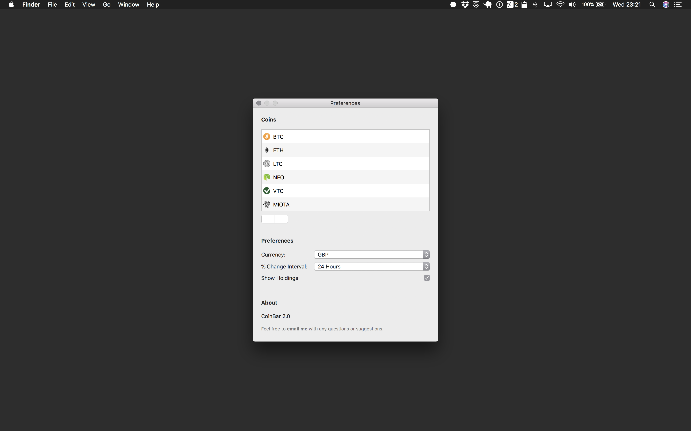

# CoinBar

CoinBar is an open source macOS menu bar app for tracking the price of crypto coins. It's written in Swift 4 and consumes the [CoinMarketCap JSON API](https://coinmarketcap.com/api/).

## Features

- View prices of crypto coins directly from your menu bar.
- Choose from thousands of different coins to display.
- Supports 33 base currencies.
- Display price % fluctuations between 1h, 24h and 7d.
- The menu bar icon flashes when new data is available.

## Installation

Head to the [releases](https://github.com/adamwaite/CoinBar/releases) page.

## Contact

Tweet me at [@adamwaite](https://twitter.com/adamwaite) with any questions or suggestions.

## Say Thanks

BTC: `1AmAU2Ezo5p7yFs13pb1YcwzPzTyDKPvm3`

ETH: `0xd5aD2aD0Ff9a80B2b8bA5ae0DE2522626c05735C`
